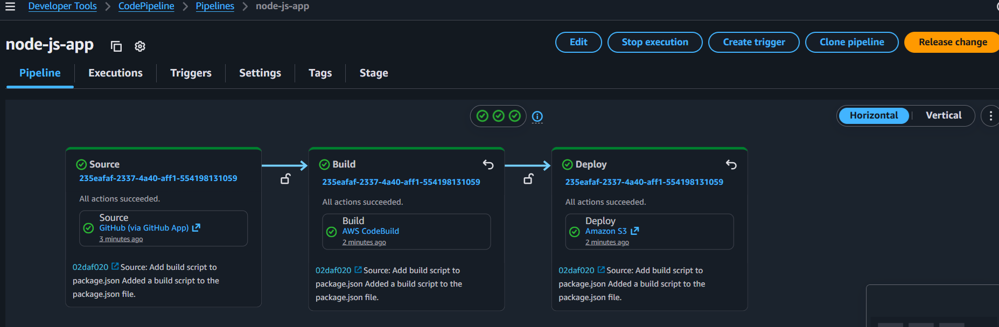

# CI-CD-Pipeline-to-Deploy-Node.js-Application
Built a CI/CD pipeline using AWS CodePipeline and CodeBuild to automatically deploy a Node.js application on every code change.

## 🎯 Purpose
Automatically deploy the application on every code change.

## 🧰 AWS Services Used
- AWS CodePipeline
- AWS CodeBuild
- Amazon EC2 / Amazon S3

## 📌 Project Overview
This project demonstrates a CI/CD pipeline for a Node.js application using AWS services. 
The pipeline automatically builds and deploys the application whenever code is updated.

## 🚀 Features
- Automated deployment
- Continuous integration
- Continuous delivery
- Faster release process

## 📸 Project Screenshots

### 1. CodePipeline
This shows the CI/CD pipeline workflow.

### 2. S3 Buckets
This shows deployment artifacts stored in S3.

---

## 📂 Project Files

### Node.js Application File
[View app.js](app.js)

### Build Specification
[View buildspec.yml](buildspec.yml)

### Frontend File
[View index.html](index.html)

### Package Configuration
[View package.json](package.json)
